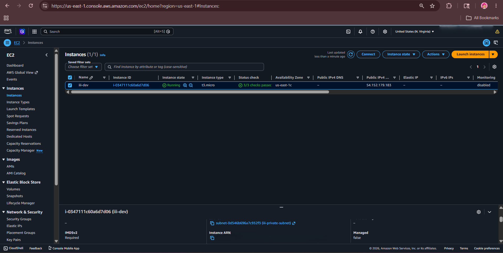
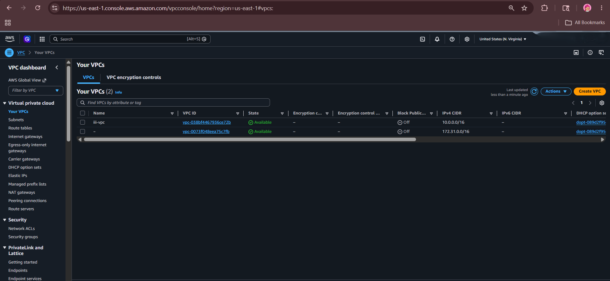
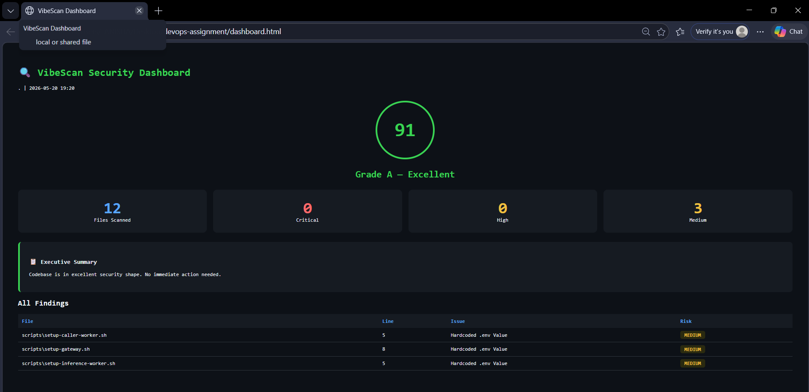
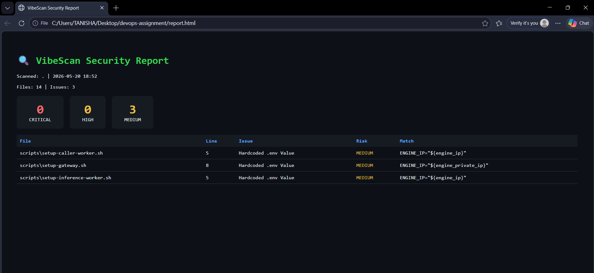

# DevOps Internship Assignment - iii Quickstart Deployment

## Executive Summary

A microservices-based ML inference system deployed on AWS cloud infrastructure. A 3-tier architecture (Gateway, Engine, Inference workers) deployed using infrastructure-as-code in a reproducible manner.

## Architecture


## Screenshots

<div align="center">
  
  
  
</div>


## Security Scan Results (VibeScan)

Validated using VibeScan — a custom-built security scanner I developed.
Results: **0 Critical | 0 High | 3 Medium** (Terraform template variables — confirmed safe)





## Technology Stack

## Tech Stack Overview

| Layer            | Technology                     | Purpose                         |
|------------------|--------------------------------|---------------------------------|
| Infrastructure   | Terraform                      | AWS resource provisioning       |
| Compute          | EC2 (t3.micro / t3.small / t3.medium) | Containerized services |
| Networking       | VPC + Private Subnet           | Secure isolation                |
| Proxy            | Nginx                          | HTTP reverse proxy             |
| Runtime          | Python + Transformers          | ML inference                   |
| Orchestration    | iii Framework                  | WebSocket RPC                  |

## Security Model

- **Network Isolation**: Private subnet VMs do not expose public access
- **Access Control**: Security groups permit only necessary ports (22, 80, 3111, 49134)
- **IAM Roles**: No embedded credentials in EC2 instances
- **No Secrets in Code**: All credentials managed externally

## Deployment Guide

```bash
# Initialize Terraform
cd terraform
terraform init

# Deploy infrastructure
terraform apply -var="my_ip_cidr=YOUR_IP/32"

# Get public IP from output
terraform output instance_public_ip
```

## API Usage

```bash
curl -X POST http://PUBLIC_IP/v1/chat/completions \
  -H "Content-Type: application/json" \
  -d '{"messages": [{"role": "user", "content": "Hello"}]}'
```

Expected response:
```json
{
  "id": "chatcmpl-xxx",
  "object": "chat.completion",
  "choices": [{
    "index": 0,
    "message": {"role": "assistant", "content": "Response from model"}
  }]
}
```

## Production Hardening Checklist

| Area | Recommendation |
|------|----------------|
| TLS | AWS ACM certificate via Application Load Balancer |
| SSH | Key-based authentication, IP whitelisting |
| IAM | Least privilege IAM roles per service |
| Logging | CloudWatch Logs + centralized aggregation |
| Monitoring | Health check endpoints, auto-restart policies |
| mTLS | Mutual TLS for inter-service communication |

## Scaling to 100x Larger Model

1. **GPU Instances**: g4dn.xlarge/g5.xlarge with NVIDIA T4/A10G
2. **Model Optimization**: INT8 quantization, tensor parallelism
3. **Storage**: S3 for model artifacts, local cache
4. **Auto Scaling**: Target tracking policies based on queue depth
5. **Caching**: Redis layer for repeated inference requests
6. **Load Balancing**: Multi-AZ deployment with sticky sessions

## File Structure

```
devops-assignment/
├── terraform/
│   ├── main.tf          # VPC, EC2, Security Groups
│   ├── variables.tf     # Input parameters
│   └── outputs.tf       # Public IP outputs
├── scripts/
│   ├── setup-engine.sh
│   ├── setup-inference-worker.sh
│   └── setup-gateway.sh
├── systemd/
│   ├── iii-engine.service
│   └── inference-worker.service
├── screenshot/
│   ├── ec2.png
│   ├── VPC.png
│   └── Security group.png
└── README.md
```

## Cost Analysis

| Resource | Type | Hourly Cost |
|----------|------|-------------|
| t3.micro | Gateway | ~$0.0104 |
| t3.small | Engine | ~$0.0208 |
| t3.medium | Inference | ~$0.0416 |
| **Total** | | **~$0.0728/hr** |

AWS Free Tier within limits for development/testing.

---