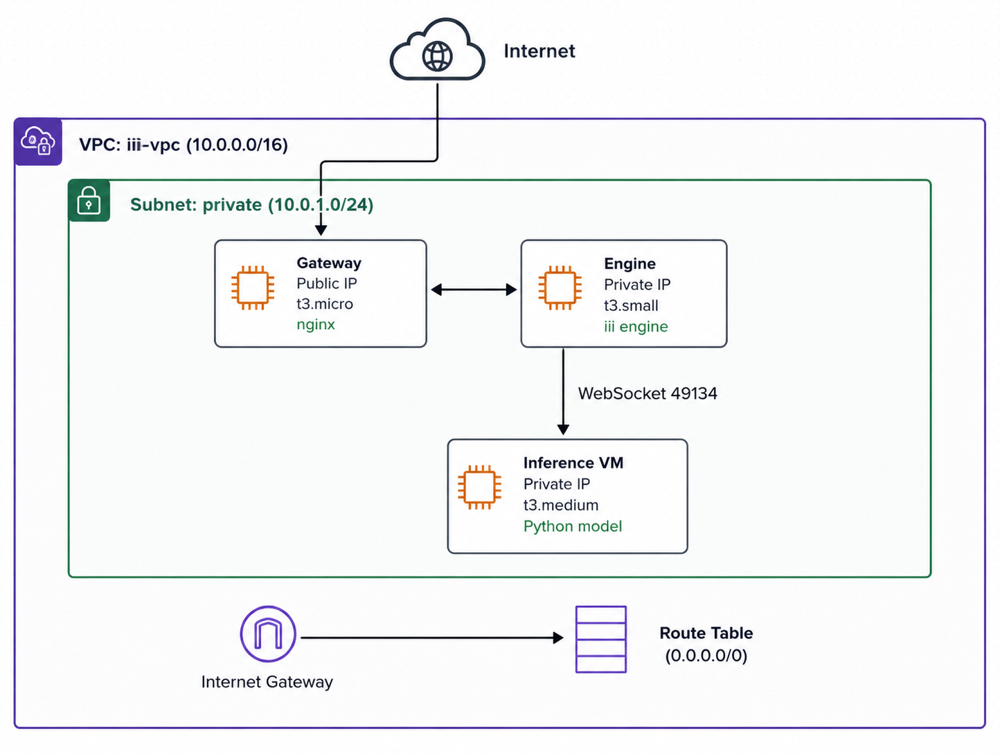

# DevOps Internship Assignment — iii Quickstart Deployment

> **Tanisha** · AWS Cloud Infrastructure · 3-Tier Microservices · Terraform IaC

---

## Executive Summary

A microservices-based ML inference system deployed on AWS cloud infrastructure. 3-tier architecture (Gateway → Engine → Inference workers) provisioned using Terraform and deployed with reproducible shell scripts and systemd service units.

---

## Architecture

<p align="center">
  
</p>


**Flow:** `Client → [Gateway VM / Nginx] → Engine VM → Inference VM → Response`

| VM | Role | Subnet |
|----|------|--------|
| Gateway | Nginx reverse proxy, public-facing API | Public |
| Engine | Request orchestration, RPC dispatch | Private |
| Inference | Model inference (Python + Transformers) | Private |

---

## Infrastructure Screenshots

<table>
  <tr>
    <td align="center"><b>EC2 Instances</b></td>
    <td align="center"><b>Security Groups</b></td>
    <td align="center"><b>VPC Configuration</b></td>
  </tr>
  <tr>
    <td></td>
    <td></td>
    <td></td>
  </tr>
</table>

---

## Security Scan — VibeScan

> This project was validated using **[VibeScan](https://github.com/tanikush/vibescan)** — a custom security scanner I built that detects hardcoded secrets, API keys, and infrastructure misconfigurations.

The 3 Medium findings are Terraform template placeholders (`${engine_ip}`) — standard infrastructure patterns, **not hardcoded credentials**. No secrets or sensitive values are present in the codebase.

<table>
  <tr>
    <td align="center"><b>VibeScan Dashboard</b></td>
    <td align="center"><b>Scan Report</b></td>
  </tr>
  <tr>
    <td></td>
    <td></td>
  </tr>
</table>

---

## Technology Stack

| Layer | Technology | Purpose |
|-------|-----------|---------|
| Infrastructure | Terraform | AWS resource provisioning |
| Compute | EC2 (t3.micro / t3.small / t3.medium) | VM instances |
| Networking | VPC + Private Subnet | Secure isolation |
| Proxy | Nginx | HTTP reverse proxy |
| Runtime | Python + Transformers | ML inference |
| Orchestration | iii Framework | WebSocket RPC |
| Process Mgmt | systemd | Service lifecycle |

---

## Security Model

| Control | Implementation |
|---------|---------------|
| Network Isolation | Workers in private subnet — no direct public access |
| Port Control | Security groups allow only ports 22, 80, 3111, 49134 |
| Credentials | No embedded credentials — IAM roles on EC2 instances |
| Secrets | All secrets managed externally, none in codebase |

---

## Deployment Guide

### Prerequisites
```bash
# Required tools
terraform >= 1.0
aws-cli configured with credentials
ssh key pair created in AWS
```

### Deploy Infrastructure
```bash
# 1. Clone and navigate
git clone https://github.com/tanikush/devops-internship-assignment.git  
cd devops-assignment/terraform

# 2. Initialize Terraform
terraform init

# 3. Deploy (replace with your IP)
terraform apply -var="my_ip_cidr=YOUR_IP/32"

# 4. Get public IP
terraform output instance_public_ip
```

### Deploy Workers
```bash
# Run setup scripts on respective VMs (in order)
./scripts/setup-engine.sh
./scripts/setup-inference-worker.sh
./scripts/setup-gateway.sh
```

### Teardown
```bash
terraform destroy -var="my_ip_cidr=YOUR_IP/32"
```

---

## API Usage

```bash
curl -X POST http://<PUBLIC_IP>/v1/chat/completions \
  -H "Content-Type: application/json" \
  -d '{"messages": [{"role": "user", "content": "Hello"}]}'
```

**Sample Response:**
```json
{
  "id": "chatcmpl-xxx",
  "object": "chat.completion",
  "choices": [{
    "index": 0,
    "message": {
      "role": "assistant",
      "content": "Response from model"
    }
  }]
}
```

---

## Production Hardening

| Area | Recommendation |
|------|----------------|
| TLS | AWS ACM certificate via Application Load Balancer |
| SSH | Key-based auth only, IP whitelisting |
| IAM | Least-privilege IAM roles per service |
| Logging | CloudWatch Logs + centralized aggregation |
| Monitoring | Health check endpoints + auto-restart policies |
| mTLS | Mutual TLS for inter-VM RPC communication |
| Secrets | AWS Secrets Manager / Parameter Store |
| Updates | Automated security patching (AWS SSM) |

---

## Scaling to 100x Larger Model

1. **GPU Instances** — `g4dn.xlarge` / `g5.xlarge` with NVIDIA T4/A10G
2. **Model Optimization** — INT8 quantization, tensor parallelism across GPUs
3. **Storage** — S3 for model artifacts, EFS for shared local cache
4. **Auto Scaling** — Target tracking policies based on queue depth
5. **Caching** — Redis layer for repeated inference requests
6. **Load Balancing** — Multi-AZ deployment with Application Load Balancer

---

## Repository Structure

```
devops-assignment/
├── terraform/
│   ├── main.tf          # VPC, EC2, Security Groups
│   ├── variables.tf     # Input parameters
│   └── outputs.tf       # Public IP outputs
├── scripts/
│   ├── setup-engine.sh
│   ├── setup-inference-worker.sh
│   ├── setup-gateway.sh
│   └── setup-caller-worker.sh
├── systemd/
│   ├── iii-engine.service
│   ├── inference-worker.service
│   └── gateway.service
├── screenshot/
│   ├── Architecture.png
│   ├── ec2.png
│   ├── VPC.png
│   ├── Security group.png
│   ├── dashboard.png
│   └── report.png
└── README.md
```

---

## Cost Estimate

| Resource | Instance Type | Hourly Cost |
|----------|--------------|-------------|
| Gateway VM | t3.micro | ~$0.0104 |
| Engine VM | t3.small | ~$0.0208 |
| Inference VM | t3.medium | ~$0.0416 |
| **Total** | | **~$0.073/hr (~$1.75/day)** |

> Within AWS Free Tier limits for development and testing.

---

*Submitted by Tanisha · DevOps Internship Assignment · May 2026*
